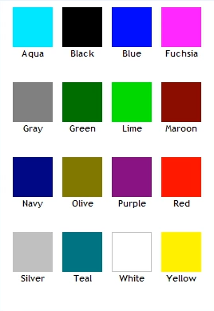
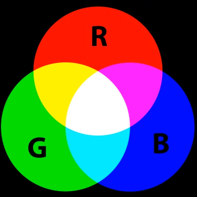
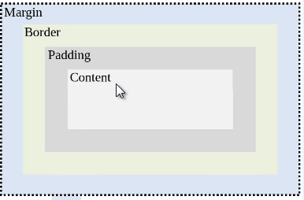
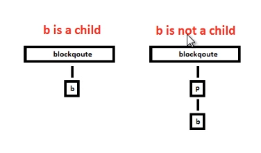
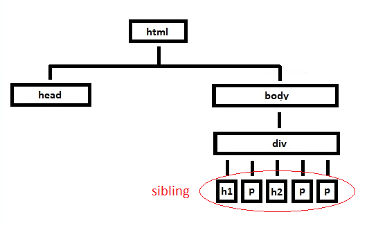

# CSS Exercises

## Exercise 1
This exercise add a sytle to the html file. set the H1's background coler to purple.
Using &lt;style&gt; tag in the html file directly.


## Exercise 2
Set tag P's color, font-size, font-family properties.

## Exercise 3
Multiple selectors defining.
we can define multiple selectors' properties at sametime. Just using the ',' to join these selectors together.
Then these selectors will have same properties' value. 
If one of these selectors has special properties, we can define this selecter again with the special properties.
Then all the properties will combine together to effect on the selecter.

## Exercise 4
Add a line to header and border property.

## Exercise 5
Inheritance and overriding. 


1. Rules later in the source order generally override earlier rules.
2. IDs/class selectors have higher specificity than element selectors.
3. IDs have an even higher specificity than classes.
4. In CSS, there is a special piece of syntax you can use to make sure that a certain declaration 
will always win over all others: **!important.**
```css
.better {
  background-color: gray;
  border: none !important;
}
```

reference: [Cascade and inheritance](https://developer.mozilla.org/en-US/docs/Learn/CSS/Introduction_to_CSS/Cascade_and_inheritance)

## Exercise 6
Using Classes in CSS

To define a class, put '.' just before the class name. To specify which tag effect on, can add the tag selector right before the '.'.

```css
    p.purple {
        color: purple;
        font-size: 25px;
        font-family: Helvetica;
    }
```
To use the class,  specify the class name with class attribute of the element.
```html
<p class="purple">Bass fish live in lakes.</p>
```

## Exercise 7
More on Classes in CSS

If we define a class not beginning with any selector, this class can be used by any element.
And class and element is a more-to-more relationship. 
To set multiple classes to one element. can combine the classes together spliting by space.
```html
    <blockquote class="blue underline">
        This is a indent.
    </blockquote>
```
This recipe shows the element blockquote has two classes: blue and underline.

## Exercise 8
Font Family

We can set font-family with multiple fonts. splited by ',';
```css
body {
        color: green; /*this property will be inherite by the child element*/
        font-family: Verdana, Arial, Geneva, Arial Black;
}
```
If the first font is not found, the second one will be used, and if no second then third, and so on.
If all fonts are not found, the browser's default font will be used.

## Exercise 9
The Font Weight Property
lighter, normal, bold, bolder

## Exercise 10
Using an external style sheet

We can save the style definitions in a external file, so the styles can be shared in several files.
And add link in the html file. To link an external stylesheet, you'd include a &lt;link&gt; element inside your &lt;head&gt;
```html
<head>
    <link rel="stylesheet" type="text/css" href="stylesheet.css">
</head>
```
The path to the stylesheet inside an **href** attribute;
The **rel** stands for "relationship";
The **type** attribute is used to define the type of the content linked to.

## Exercise 11
Text-decoration property
```css
h1, h2 {
   /*text-decoration: underline;*/
   /*text-decoration: line-through;*/
   /*text-decoration: overline;*/
   text-decoration: underline line-through overline;
}
```

## Exercise 12
Italic fonts
We can set the text to italic in css and in the html.
```css
p.para3 {
    color: purple;
    font-size: 25px;
    /*font-style: italic;*/
    font-style: oblique;
}
```
We can use tag &lt;i&gt; to specify the text to italic in html.
```html
<p class="para2">Bass fish live in lakes. The word for fish in Latin is <i>Pisces</i>>.</p>
```

## Exercise 13
Web Colors

 

To specify the colors, we can use the color name, RGB funcation or HEX code;
```css
black;
rgb(240, 28, 235);
#FFCF79;
```

## Exercise 14
 Using inline style

 style types: internal style, external style and inline style.
 internal style appears in the __head__ of the html, surrounded by &lt;style&gt;;
 external style is defined in the css file, and linked to the html;
 inline style is defined in the element __style__ attribute.

 ```html
 <p style="color:black;font-size:25px;" >This is inline style.</p>
 ```

## Exercise 15
More on Font sizes

The font-size property is specified in one of the following ways:

As one of the **absolute-size** or **relative-size** keywords;

As a &lt;length&gt; or a &lt;percentage&gt;, relative to the parent element's font size;

xx-small | x-small | small | medium | large | x-large | xx-large

px, em

## Exercise 16
Line height property

## Exercise 17
CSS Box Model Part 1



## Exercise 18
CSS Box Model Part 2

body has a default margin.

## Exercise 19
CSS Box Model Part 3

```css
    display : block;
```
The element generates a block element box, generating **line breaks** both before and after the element when in the normal flow.

## Exercise 20
CSS Box Model Part 4

background-color property only applies to padding and content

can combine padding to one line: padding: 10px 10px 10px 10px;

can combine border too

margin too too.


## Exercise 21
Background image property

To refer a picture in background-image, using the url();

## Exercise 22
The ID Attribute

ID style defined by starting '#'.

## Exercise 23
The text align property

text-align: [center|left|right]

## Exercise 24
Border Property Part 1

border property

border-color

    [NAME|RGB|HEX]

border-width

    [thin|medium|thick|px]

border-style:

    [solid|dashed|dotted|double|groove|inset|outset|ridge]

## Exercise 25
Border Property Part 2

border-radius, border-bottom-left-radius, border-bottom-right-radius, border-top-left-radius, border-top-right-radius

border-bottom, border-top, border-left, border-right

## Exercise 26
The DIV element

DIV use to divid the web page into logical sections.

## Exercise 27
The SPAN element

SPAN is similar to the DIV, but operates on smaller scale.

A SPAN element is in-line and selects small chunk of HTML.

## Exercise 28
Add content page and reuse some of our CSS classes

## Exercise 29
Special effects

## Exercise 30
Block and Inline elements Part

block element

inline element

## Exercise 31
Block and Inline elements Part 2

## Exercise 32
Block and Inline elements Part 3

## Exercise 33
floating an element

The float CSS property specifies that an element should be placed along the left or right side of its container, allowing text and inline elements to wrap around it. The element is removed from the normal flow of the web page, though still remaining a part of the flow (in contrast to absolute positioning).

reference: [float](https://developer.mozilla.org/en-US/docs/Web/CSS/float)

## Exercise 34
Absolute position for an element

## Exercise 35
Fixed position for an element

It is positioned relative to the initial containing block established by the **viewport**.
Reference: [position](https://developer.mozilla.org/en-US/docs/Web/CSS/position)

## Exercise 36
The overflow property


## Exercise 37
The cursor property

    default, inherit, auto, URL, crosshair, pointer, move, text, help, hand, no-drop, alias, progress, wait, grab, grabbing, copy, cell spinning, none

## Exercise 38
Custom cursor

## Exercise 39
Text and images

## Exercise 40
Relative positioning

## Exercise 41
Vertical menu

## Exercise 43
Horizontal menu

## Exercise 44
A nice button

## Exercise 45
The inline-block

## Exercise 46
Web Forms Part

display: table | display: table-row | display:table-cell

## Exercise 48
Review and descendant selector - Selectors Part 

Type Selector

ID Selector

class Selector

combine selector

Descendant selector

Child selector





## Exercise 56
Opacity property

# Exercise 59
shadow