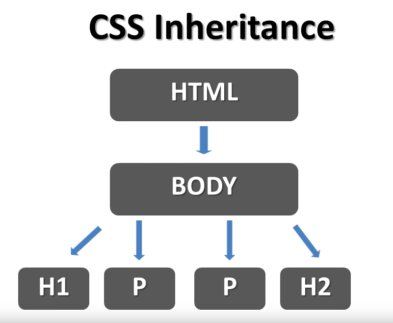

# CSS Exercises

## Exercise 1
This exercise add a sytle to the html file. set the H1's background coler to purple.
Using &lt;style&gt; tag in the html file directly.


## Exercise 2
Set tag P's color, font-size, font-family properties.

## Exercise 3
Multiple selectors defining.
we can define multiple selectors' properties at sametime. Just using the ',' to join these selectors together.
Then these selectors will have same properties' value. 
If one of these selectors has special properties, we can define this selecter again with the special properties.
Then all the properties will combine together to effect on the selecter.

## Exercise 4
Add a line to header and border property.

## Exercise 5
Inheritance and overriding. 



1. Rules later in the source order generally override earlier rules.
2. IDs/class selectors have higher specificity than element selectors.
3. IDs have an even higher specificity than classes.
4. In CSS, there is a special piece of syntax you can use to make sure that a certain declaration 
will always win over all others: **!important.**
```css
.better {
  background-color: gray;
  border: none !important;
}
```

reference: [Cascade and inheritance](https://developer.mozilla.org/en-US/docs/Learn/CSS/Introduction_to_CSS/Cascade_and_inheritance)

## Exercise 6
Using Classes in CSS

To define a class, put '.' just before the class name. To specify which tag effect on, can add the tag selector right before the '.'.

```css
    p.purple {
        color: purple;
        font-size: 25px;
        font-family: Helvetica;
    }
```
To use the class,  specify the class name with class attribute of the element.
```html
<p class="purple">Bass fish live in lakes.</p>
```

## Exercise 7
More on Classes in CSS

If we define a class not beginning with any selector, this class can be used by any element.
And class and element is a more-to-more relationship. 
To set multiple classes to one element. can combine the classes together spliting by space.
```html
    <blockquote class="blue underline">
        This is a indent.
    </blockquote>
```
This recipe shows the element blockquote has two classes: blue and underline.

## Exercise 8
Font Family

We can set font-family with multiple fonts. splited by ',';
```css
body {
        color: green; /*this property will be inherite by the child element*/
        font-family: Verdana, Arial, Geneva, Arial Black;
}
```
If the first font is not found, the second one will be used, and if no second then third, and so on.
If all fonts are not found, the browser's default font will be used.

## Exercise 9
The Font Weight Property
lighter, normal, bold, bolder

## Exercise 10
Using an external style sheet

We can save the style definitions in a external file, so the styles can be shared in several files.
And add link in the html file. To link an external stylesheet, you'd include a &lt;link&gt; element inside your &lt;head&gt;
```html
<head>
    <link rel="stylesheet" type="text/css" href="stylesheet.css">
</head>
```
The path to the stylesheet inside an **href** attribute;
The **rel** stands for "relationship";
The **type** attribute is used to define the type of the content linked to.

## Exercise 11
Text-decoration property
```css
h1, h2 {
   /*text-decoration: underline;*/
   /*text-decoration: line-through;*/
   /*text-decoration: overline;*/
   text-decoration: underline line-through overline;
}
```